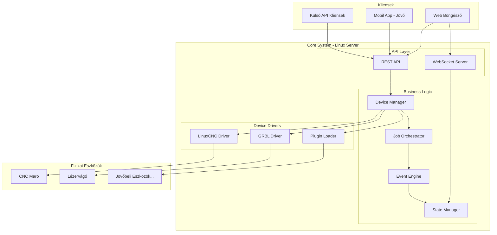
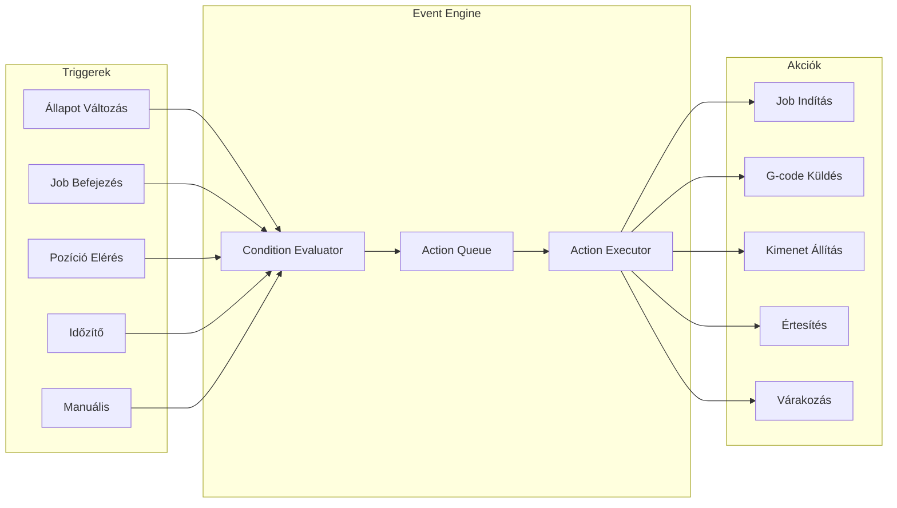
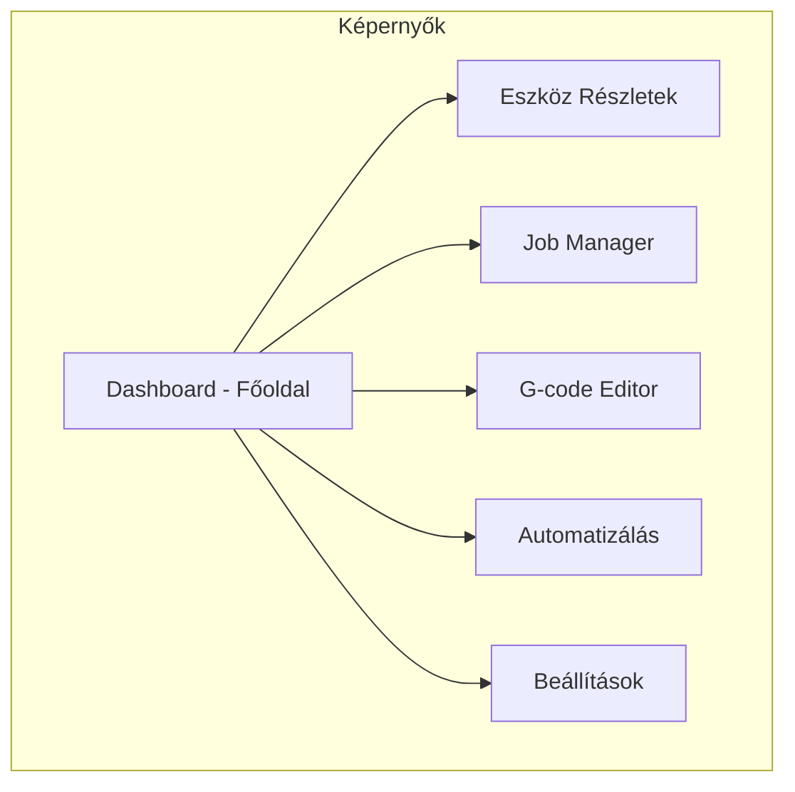
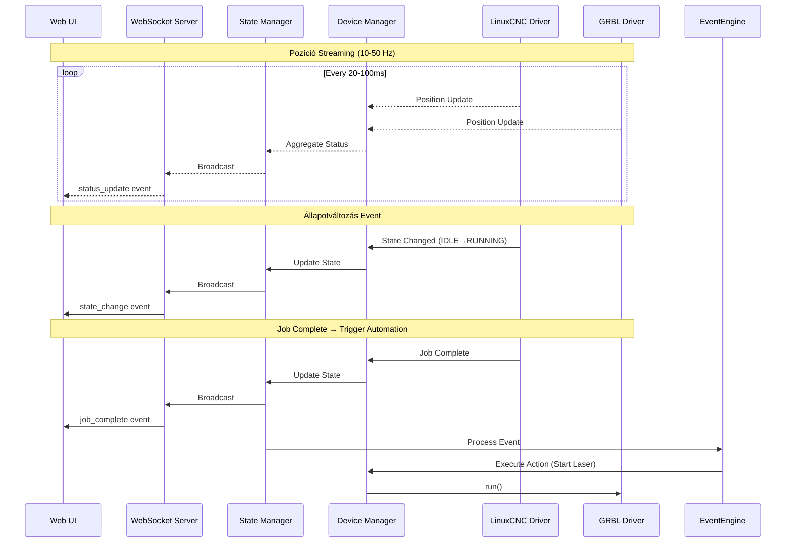

# Multi-Robot Control System - Részletes Terv

## 1. Rendszer Áttekintés

### 1.1 Célkitűzések

- Több CNC/robotizált egység központi vezérlése
- Bővíthető architektúra új eszközök egyszerű hozzáadásához
- Állapot-alapú koordináció az egységek között
- Eseményvezérelt automatizálás (triggers, actions)
- Modern, reszponzív webes felület

### 1.2 Kezdeti Eszközök

| Eszköz | Típus | Vezérlés | Kapcsolat |

|--------|-------|----------|-----------|

| CNC Maró | JP-3163B + TB6560 | LinuxCNC | PCI LPT |

| Lézervágó | EleksMana W5.2 | GRBL 1.1 | USB Serial |

### 1.3 Jövőbeli Bővítési Lehetőségek

- 3D nyomtató (Marlin/Klipper)
- Forgóasztal / indexer
- Robot kar (GRBL/custom)
- Szállítószalag
- Mérőeszközök, szkennerek

---

## 2. Rendszer Architektúra

### 2.1 Magas Szintű Architektúra



### 2.2 Rétegek Részletezése

#### Device Driver Layer (Python)

```
drivers/
├── base.py                 # Abstract base class
├── linuxcnc_driver.py      # LinuxCNC implementáció
├── grbl_driver.py          # GRBL implementáció
├── plugins/                # Bővítmények
│   ├── __init__.py
│   ├── marlin_driver.py    # 3D nyomtató (jövő)
│   └── klipper_driver.py   # Klipper (jövő)
└── registry.py             # Driver registry
```

#### Business Logic Layer (Node.js/Python)

```
backend/
├── src/
│   ├── devices/
│   │   ├── DeviceManager.ts
│   │   └── DeviceRegistry.ts
│   ├── jobs/
│   │   ├── JobQueue.ts
│   │   ├── JobOrchestrator.ts
│   │   └── SyncManager.ts
│   ├── events/
│   │   ├── EventEngine.ts
│   │   ├── TriggerManager.ts
│   │   └── ActionExecutor.ts
│   └── state/
│       ├── StateManager.ts
│       └── StateStore.ts
```

---

## 3. Bővíthetőségi Rendszer

### 3.1 Device Plugin Interface

```python
# drivers/base.py
from abc import ABC, abstractmethod
from typing import Optional, Callable
from dataclasses import dataclass
from enum import Enum

class DeviceType(Enum):
    CNC_MILL = "cnc_mill"
    CNC_LATHE = "cnc_lathe"
    LASER_CUTTER = "laser_cutter"
    LASER_ENGRAVER = "laser_engraver"
    PRINTER_3D = "printer_3d"
    ROBOT_ARM = "robot_arm"
    CONVEYOR = "conveyor"
    ROTARY_TABLE = "rotary_table"
    CUSTOM = "custom"

class DeviceState(Enum):
    DISCONNECTED = "disconnected"
    CONNECTING = "connecting"
    IDLE = "idle"
    RUNNING = "running"
    PAUSED = "paused"
    ALARM = "alarm"
    HOMING = "homing"
    PROBING = "probing"

@dataclass
class DeviceCapabilities:
    axes: list[str]           # ["X", "Y", "Z", "A"]
    has_spindle: bool
    has_laser: bool
    has_coolant: bool
    has_probe: bool
    has_tool_changer: bool
    max_feed_rate: float
    work_envelope: dict       # {x: 300, y: 400, z: 80}

@dataclass
class DeviceStatus:
    state: DeviceState
    position: dict[str, float]
    feed_rate: float
    spindle_speed: float
    laser_power: float
    progress: float
    current_line: int
    total_lines: int
    error_message: Optional[str]

class DeviceDriver(ABC):
    """Abstract base class for all device drivers"""
    
    device_type: DeviceType
    device_id: str
    device_name: str
    
    # Event callbacks
    on_state_change: Optional[Callable[[DeviceState], None]] = None
    on_position_update: Optional[Callable[[dict], None]] = None
    on_error: Optional[Callable[[str], None]] = None
    on_job_complete: Optional[Callable[[], None]] = None
    
    @abstractmethod
    async def connect(self) -> bool:
        """Establish connection to device"""
        pass
    
    @abstractmethod
    async def disconnect(self) -> None:
        """Close connection"""
        pass
    
    @abstractmethod
    async def get_capabilities(self) -> DeviceCapabilities:
        """Return device capabilities"""
        pass
    
    @abstractmethod
    async def get_status(self) -> DeviceStatus:
        """Get current device status"""
        pass
    
    @abstractmethod
    async def home(self, axes: list[str] = None) -> None:
        """Home specified axes or all"""
        pass
    
    @abstractmethod
    async def jog(self, axis: str, distance: float, feed: float) -> None:
        """Jog movement"""
        pass
    
    @abstractmethod
    async def send_gcode(self, gcode: str) -> str:
        """Send single G-code command (MDI)"""
        pass
    
    @abstractmethod
    async def load_file(self, filepath: str) -> None:
        """Load G-code file for execution"""
        pass
    
    @abstractmethod
    async def run(self) -> None:
        """Start/resume program execution"""
        pass
    
    @abstractmethod
    async def pause(self) -> None:
        """Pause execution (feed hold)"""
        pass
    
    @abstractmethod
    async def stop(self) -> None:
        """Stop execution"""
        pass
    
    @abstractmethod
    async def reset(self) -> None:
        """Reset device (clear alarm)"""
        pass
```

### 3.2 Új Eszköz Hozzáadása

```python
# drivers/plugins/marlin_driver.py
from drivers.base import DeviceDriver, DeviceType, DeviceCapabilities

class MarlinDriver(DeviceDriver):
    """Driver for Marlin-based 3D printers"""
    
    device_type = DeviceType.PRINTER_3D
    
    def __init__(self, device_id: str, port: str, baudrate: int = 250000):
        self.device_id = device_id
        self.port = port
        self.baudrate = baudrate
        # ... implementation
```

### 3.3 Konfiguráció Fájl

```yaml
# config/devices.yaml
devices:
  - id: cnc_main
    name: "CNC Maró"
    driver: linuxcnc
    type: cnc_mill
    config:
      ini_file: /home/user/linuxcnc/configs/jp3163b/jp3163b.ini
    
  - id: laser_1
    name: "Lézervágó"
    driver: grbl
    type: laser_cutter
    config:
      port: /dev/ttyUSB0
      baudrate: 115200
      
  # Jövőbeli eszköz példa
  - id: printer_1
    name: "3D Nyomtató"
    driver: marlin
    type: printer_3d
    enabled: false  # Még nem aktív
    config:
      port: /dev/ttyACM0
      baudrate: 250000
```

---

## 4. Állapot-Alapú Koordináció

### 4.1 Event Engine Architektúra



### 4.2 Koordinációs Szabályok (Rules)

```yaml
# config/automation_rules.yaml
rules:
  # 1. Szekvenciális végrehajtás
  - id: sequential_cnc_laser
    name: "CNC után Lézer"
    enabled: true
    trigger:
      type: job_complete
      device: cnc_main
    conditions:
      - device: cnc_main
        state: idle
      - device: laser_1
        state: idle
    actions:
      - type: load_file
        device: laser_1
        file: "{{last_job.laser_file}}"
      - type: run
        device: laser_1
        
  # 2. Párhuzamos indítás szinkronizációval
  - id: parallel_start
    name: "Párhuzamos Indítás"
    enabled: true
    trigger:
      type: manual
      event: start_parallel_job
    conditions:
      - device: cnc_main
        state: idle
      - device: laser_1
        state: idle
    actions:
      - type: run
        device: cnc_main
      - type: run
        device: laser_1
        
  # 3. Szinkronizációs pont
  - id: sync_point_wait
    name: "Sync Point - Várakozás"
    enabled: true
    trigger:
      type: gcode_comment
      pattern: ";SYNC_POINT_(\\d+)"
    actions:
      - type: pause
        device: "{{trigger.device}}"
      - type: set_flag
        flag: "sync_{{trigger.match[1]}}_{{trigger.device}}"
        value: true
      - type: check_sync
        sync_id: "{{trigger.match[1]}}"
        devices: [cnc_main, laser_1]
        on_complete:
          - type: resume
            device: cnc_main
          - type: resume
            device: laser_1
            
  # 4. Hibakezlés
  - id: error_stop_all
    name: "Hiba - Mindent Leállít"
    enabled: true
    trigger:
      type: state_change
      to_state: alarm
    actions:
      - type: stop
        device: all
      - type: notify
        channel: ui
        message: "ALARM: {{trigger.device}} - {{trigger.error}}"
        
  # 5. Pozíció-alapú trigger
  - id: position_trigger
    name: "Pozíció Elérése"
    enabled: false
    trigger:
      type: position
      device: cnc_main
      axis: Z
      condition: "<="
      value: -50
    actions:
      - type: send_gcode
        device: laser_1
        gcode: "M3 S100"  # Lézer be
```

### 4.3 Event Engine Implementáció

```typescript
// backend/src/events/EventEngine.ts
interface Trigger {
  type: 'state_change' | 'job_complete' | 'position' | 'timer' | 'manual' | 'gcode_comment';
  device?: string;
  // ... trigger-specific params
}

interface Condition {
  device: string;
  state?: DeviceState;
  position?: { axis: string; operator: string; value: number };
  custom?: (context: EventContext) => boolean;
}

interface Action {
  type: 'run' | 'pause' | 'stop' | 'load_file' | 'send_gcode' | 'notify' | 'wait' | 'set_flag';
  device?: string | 'all';
  // ... action-specific params
}

interface Rule {
  id: string;
  name: string;
  enabled: boolean;
  trigger: Trigger;
  conditions: Condition[];
  actions: Action[];
}

class EventEngine {
  private rules: Rule[] = [];
  private deviceManager: DeviceManager;
  private stateManager: StateManager;
  
  // Szabályok betöltése
  async loadRules(configPath: string): Promise<void>;
  
  // Esemény feldolgozás
  async processEvent(event: DeviceEvent): Promise<void> {
    for (const rule of this.rules) {
      if (!rule.enabled) continue;
      
      if (this.matchesTrigger(event, rule.trigger)) {
        if (await this.evaluateConditions(rule.conditions)) {
          await this.executeActions(rule.actions, event);
        }
      }
    }
  }
  
  // Akciók végrehajtása
  private async executeActions(actions: Action[], context: EventContext): Promise<void>;
}
```

---

## 5. Felhasználói Felület (UI) Terv

### 5.1 Fő Képernyők



### 5.2 Dashboard - Főoldal

```
┌─────────────────────────────────────────────────────────────────────┐
│  🔧 Multi-Robot Control Hub                    [⚙️] [🔔] [👤]       │
├─────────────────────────────────────────────────────────────────────┤
│                                                                     │
│  ┌─────────────────────┐  ┌─────────────────────┐  ┌─────────────┐ │
│  │ CNC Maró            │  │ Lézervágó           │  │ + Eszköz    │ │
│  │ ━━━━━━━━━━━━━━━━━━━ │  │ ━━━━━━━━━━━━━━━━━━━ │  │ Hozzáadása  │ │
│  │ ● IDLE              │  │ ● RUNNING  ▶️       │  │             │ │
│  │                     │  │ ████████░░ 78%      │  │     ┌───┐   │ │
│  │ X:  125.00 mm       │  │                     │  │     │ + │   │ │
│  │ Y:  200.50 mm       │  │ X:   45.20 mm       │  │     └───┘   │ │
│  │ Z:  -15.00 mm       │  │ Y:   80.10 mm       │  │             │ │
│  │                     │  │                     │  └─────────────┘ │
│  │ Feed: 0 mm/min      │  │ Feed: 1200 mm/min   │                  │
│  │ Spindle: OFF        │  │ Laser: 80%          │                  │
│  │                     │  │                     │                  │
│  │ [🏠Home][▶️Run][⏹️] │  │ [⏸️Pause][⏹️Stop]   │                  │
│  └─────────────────────┘  └─────────────────────┘                  │
│                                                                     │
│  ┌─────────────────────────────────────────────────────────────┐   │
│  │ Job Queue                                          [+ Add]   │   │
│  │ ─────────────────────────────────────────────────────────── │   │
│  │ 1. ✓ part_001.nc     CNC Maró      Completed    12:05       │   │
│  │ 2. ▶ engrave_001.nc  Lézervágó     Running      78%         │   │
│  │ 3. ○ part_002.nc     CNC Maró      Pending      --          │   │
│  │ 4. ○ cut_002.nc      Lézervágó     Pending      --          │   │
│  └─────────────────────────────────────────────────────────────┘   │
│                                                                     │
│  ┌─────────────────────────────────────────────────────────────┐   │
│  │ Aktív Automatizálások                                        │   │
│  │ ─────────────────────────────────────────────────────────── │   │
│  │ ● "CNC után Lézer" - Várakozás CNC befejezésére             │   │
│  │ ○ "Párhuzamos Indítás" - Készenlét                          │   │
│  └─────────────────────────────────────────────────────────────┘   │
│                                                                     │
└─────────────────────────────────────────────────────────────────────┘
```

### 5.3 Eszköz Részletek Nézet

```
┌─────────────────────────────────────────────────────────────────────┐
│  ← Vissza    CNC Maró - JP-3163B                    [⚙️ Config]     │
├─────────────────────────────────────────────────────────────────────┤
│                                                                     │
│  ┌──────────────────────────────┐  ┌────────────────────────────┐  │
│  │ Állapot: ● IDLE              │  │      2D/3D Előnézet        │  │
│  │                              │  │                            │  │
│  │ Pozíció:                     │  │    ┌─────────────────┐    │  │
│  │   X:  125.000 mm  [0️⃣]      │  │    │                 │    │  │
│  │   Y:  200.500 mm  [0️⃣]      │  │    │    ╭─────╮     │    │  │
│  │   Z:  -15.000 mm  [0️⃣]      │  │    │    │     │     │    │  │
│  │                              │  │    │    ╰─────╯     │    │  │
│  │ Feed Rate:    0 mm/min       │  │    │       ✕        │    │  │
│  │ Spindle:      OFF            │  │    └─────────────────┘    │  │
│  │ Coolant:      OFF            │  │                            │  │
│  └──────────────────────────────┘  └────────────────────────────┘  │
│                                                                     │
│  ┌──────────────────────────────────────────────────────────────┐  │
│  │ Kézi Vezérlés (Jog)                                          │  │
│  │                                                              │  │
│  │        [  Y+  ]           [  Z+  ]      Lépésköz:            │  │
│  │   [X-] [HOME] [X+]                      ○ 0.1  ○ 1           │  │
│  │        [  Y-  ]           [  Z-  ]      ● 10   ○ 100 mm      │  │
│  │                                                              │  │
│  │   Feed: [====●=====] 1000 mm/min                             │  │
│  └──────────────────────────────────────────────────────────────┘  │
│                                                                     │
│  ┌──────────────────────────────────────────────────────────────┐  │
│  │ MDI Parancs                                                  │  │
│  │ ┌────────────────────────────────────────────────┐ [Küldés] │  │
│  │ │ G0 X0 Y0                                       │          │  │
│  │ └────────────────────────────────────────────────┘          │  │
│  │                                                              │  │
│  │ Előzmények:                                                  │  │
│  │ > G0 X0 Y0           ok                                      │  │
│  │ > G1 X100 F500       ok                                      │  │
│  │ > M3 S12000          ok                                      │  │
│  └──────────────────────────────────────────────────────────────┘  │
│                                                                     │
│  [🏠 Home All] [▶️ Run] [⏸️ Pause] [⏹️ Stop] [🔄 Reset]            │
│                                                                     │
└─────────────────────────────────────────────────────────────────────┘
```

### 5.4 Job Manager

```
┌─────────────────────────────────────────────────────────────────────┐
│  Job Manager                                      [+ Új Job]        │
├─────────────────────────────────────────────────────────────────────┤
│                                                                     │
│  ┌─────────────────────────────────────────────────────────────┐   │
│  │ Végrehajtási Mód:                                            │   │
│  │ ● Szekvenciális    ○ Párhuzamos    ○ Manuális               │   │
│  └─────────────────────────────────────────────────────────────┘   │
│                                                                     │
│  ┌─────────────────────────────────────────────────────────────┐   │
│  │ Job Queue                                    [▶️ Start All]  │   │
│  │ ═══════════════════════════════════════════════════════════ │   │
│  │                                                              │   │
│  │  ☰  1. part_roughing.nc                                     │   │
│  │      Eszköz: CNC Maró                                       │   │
│  │      Becsült idő: 25 perc                                   │   │
│  │      [Szerkesztés] [Előnézet] [🗑️]                          │   │
│  │                                                              │   │
│  │  ☰  2. part_finishing.nc                                    │   │
│  │      Eszköz: CNC Maró                                       │   │
│  │      Becsült idő: 45 perc                                   │   │
│  │      Függ: #1 befejezésétől                                 │   │
│  │      [Szerkesztés] [Előnézet] [🗑️]                          │   │
│  │                                                              │   │
│  │  ☰  3. engrave_logo.nc                                      │   │
│  │      Eszköz: Lézervágó                                      │   │
│  │      Becsült idő: 8 perc                                    │   │
│  │      Függ: #2 befejezésétől                                 │   │
│  │      [Szerkesztés] [Előnézet] [🗑️]                          │   │
│  │                                                              │   │
│  └─────────────────────────────────────────────────────────────┘   │
│                                                                     │
│  ┌─────────────────────────────────────────────────────────────┐   │
│  │ Szinkronizációs Pontok (Párhuzamos módhoz)                   │   │
│  │                                                              │   │
│  │  [+ Sync Point]                                              │   │
│  │                                                              │   │
│  │  SYNC_1: CNC Z pozíció < -10mm → Lézer Start                │   │
│  │  SYNC_2: Mindkét eszköz IDLE → Értesítés küldése            │   │
│  └─────────────────────────────────────────────────────────────┘   │
│                                                                     │
└─────────────────────────────────────────────────────────────────────┘
```

### 5.5 Automatizálás / Rules Editor

```
┌─────────────────────────────────────────────────────────────────────┐
│  Automatizálás                                   [+ Új Szabály]     │
├─────────────────────────────────────────────────────────────────────┤
│                                                                     │
│  ┌─────────────────────────────────────────────────────────────┐   │
│  │ Aktív Szabályok                                              │   │
│  │ ─────────────────────────────────────────────────────────── │   │
│  │                                                              │   │
│  │ [✓] CNC után Lézer                                          │   │
│  │     AMIKOR: CNC Maró job befejez                             │   │
│  │     AKKOR:  Lézervágó job indítás                            │   │
│  │     [Szerkesztés] [🗑️]                                       │   │
│  │                                                              │   │
│  │ [✓] Hiba - Mindent Leállít                                  │   │
│  │     AMIKOR: Bármely eszköz ALARM állapotba kerül            │   │
│  │     AKKOR:  Minden eszköz leállítása + Értesítés            │   │
│  │     [Szerkesztés] [🗑️]                                       │   │
│  │                                                              │   │
│  │ [ ] Pozíció Trigger (letiltva)                              │   │
│  │     AMIKOR: CNC Z <= -50mm                                   │   │
│  │     AKKOR:  Lézer bekapcsolás                                │   │
│  │     [Szerkesztés] [🗑️]                                       │   │
│  │                                                              │   │
│  └─────────────────────────────────────────────────────────────┘   │
│                                                                     │
│  ┌─────────────────────────────────────────────────────────────┐   │
│  │ Szabály Szerkesztő                                           │   │
│  │ ─────────────────────────────────────────────────────────── │   │
│  │                                                              │   │
│  │ Név: [Új Szabály________________________]                   │   │
│  │                                                              │   │
│  │ TRIGGER (Mikor):                                             │   │
│  │ ┌─────────────────────────────────────────────────────────┐ │   │
│  │ │ Típus: [Job Befejezés     ▼]                            │ │   │
│  │ │ Eszköz: [CNC Maró         ▼]                            │ │   │
│  │ └─────────────────────────────────────────────────────────┘ │   │
│  │                                                              │   │
│  │ FELTÉTELEK (Ha):                                [+ Feltétel] │   │
│  │ ┌─────────────────────────────────────────────────────────┐ │   │
│  │ │ [Lézervágó    ▼] állapota [IDLE           ▼]            │ │   │
│  │ └─────────────────────────────────────────────────────────┘ │   │
│  │                                                              │   │
│  │ AKCIÓK (Akkor):                                   [+ Akció] │   │
│  │ ┌─────────────────────────────────────────────────────────┐ │   │
│  │ │ 1. [Job Indítás  ▼] → [Lézervágó ▼] → [Fájl kiválasztás]│ │   │
│  │ │ 2. [Értesítés    ▼] → "CNC kész, lézer indult"          │ │   │
│  │ └─────────────────────────────────────────────────────────┘ │   │
│  │                                                              │   │
│  │                                    [Mégse] [Mentés]         │   │
│  └─────────────────────────────────────────────────────────────┘   │
│                                                                     │
└─────────────────────────────────────────────────────────────────────┘
```

### 5.6 UI Komponens Hierarchia

```
frontend/src/
├── App.tsx
├── pages/
│   ├── Dashboard.tsx
│   ├── DeviceDetail.tsx
│   ├── JobManager.tsx
│   ├── GCodeEditor.tsx
│   ├── Automation.tsx
│   └── Settings.tsx
├── components/
│   ├── layout/
│   │   ├── Header.tsx
│   │   ├── Sidebar.tsx
│   │   └── MainLayout.tsx
│   ├── devices/
│   │   ├── DeviceCard.tsx
│   │   ├── DeviceStatus.tsx
│   │   ├── PositionDisplay.tsx
│   │   ├── JogControl.tsx
│   │   ├── MdiConsole.tsx
│   │   └── PathPreview.tsx
│   ├── jobs/
│   │   ├── JobQueue.tsx
│   │   ├── JobItem.tsx
│   │   ├── JobEditor.tsx
│   │   └── SyncPointEditor.tsx
│   ├── automation/
│   │   ├── RuleList.tsx
│   │   ├── RuleEditor.tsx
│   │   ├── TriggerSelector.tsx
│   │   ├── ConditionBuilder.tsx
│   │   └── ActionBuilder.tsx
│   └── common/
│       ├── Button.tsx
│       ├── Modal.tsx
│       ├── Slider.tsx
│       └── StatusBadge.tsx
├── hooks/
│   ├── useDevices.ts
│   ├── useWebSocket.ts
│   ├── useJobs.ts
│   └── useAutomation.ts
├── stores/
│   ├── deviceStore.ts
│   ├── jobStore.ts
│   └── automationStore.ts
└── types/
    ├── device.ts
    ├── job.ts
    └── automation.ts
```

---

## 6. Adatfolyam és Kommunikáció

### 6.1 Real-time Kommunikáció



### 6.2 WebSocket Events

```typescript
// WebSocket események
interface WSEvents {
  // Server → Client
  'device:status': {
    deviceId: string;
    status: DeviceStatus;
  };
  
  'device:state_change': {
    deviceId: string;
    previousState: DeviceState;
    currentState: DeviceState;
  };
  
  'job:progress': {
    jobId: string;
    deviceId: string;
    progress: number;
    currentLine: number;
    totalLines: number;
  };
  
  'job:complete': {
    jobId: string;
    deviceId: string;
    duration: number;
  };
  
  'automation:triggered': {
    ruleId: string;
    ruleName: string;
    actions: string[];
  };
  
  'error': {
    deviceId?: string;
    message: string;
    severity: 'warning' | 'error' | 'critical';
  };
  
  // Client → Server
  'device:jog': {
    deviceId: string;
    axis: string;
    distance: number;
    feed: number;
  };
  
  'device:command': {
    deviceId: string;
    command: 'run' | 'pause' | 'stop' | 'home' | 'reset';
  };
  
  'device:mdi': {
    deviceId: string;
    gcode: string;
  };
}
```

---

## 7. Projekt Fájl Struktúra (Teljes)

```
arduino/
├── backend/
│   ├── src/
│   │   ├── index.ts
│   │   ├── server.ts
│   │   ├── config/
│   │   │   └── index.ts
│   │   ├── api/
│   │   │   ├── routes.ts
│   │   │   ├── devices.ts
│   │   │   ├── jobs.ts
│   │   │   └── automation.ts
│   │   ├── websocket/
│   │   │   ├── server.ts
│   │   │   └── handlers.ts
│   │   ├── devices/
│   │   │   ├── DeviceManager.ts
│   │   │   └── DeviceRegistry.ts
│   │   ├── jobs/
│   │   │   ├── JobQueue.ts
│   │   │   ├── JobOrchestrator.ts
│   │   │   └── SyncManager.ts
│   │   ├── events/
│   │   │   ├── EventEngine.ts
│   │   │   ├── TriggerManager.ts
│   │   │   └── ActionExecutor.ts
│   │   ├── state/
│   │   │   └── StateManager.ts
│   │   └── bridge/
│   │       └── PythonBridge.ts
│   ├── package.json
│   └── tsconfig.json
│
├── drivers/
│   ├── __init__.py
│   ├── base.py
│   ├── linuxcnc_driver.py
│   ├── grbl_driver.py
│   ├── bridge_server.py
│   ├── plugins/
│   │   ├── __init__.py
│   │   ├── marlin_driver.py
│   │   └── klipper_driver.py
│   ├── requirements.txt
│   └── tests/
│       ├── test_linuxcnc.py
│       └── test_grbl.py
│
├── linuxcnc-config/
│   ├── jp3163b/
│   │   ├── jp3163b.ini
│   │   ├── jp3163b.hal
│   │   ├── custom.hal
│   │   ├── postgui.hal
│   │   └── tool.tbl
│   └── README.md
│
├── frontend/
│   ├── src/
│   │   ├── App.tsx
│   │   ├── main.tsx
│   │   ├── pages/
│   │   ├── components/
│   │   ├── hooks/
│   │   ├── stores/
│   │   ├── types/
│   │   ├── utils/
│   │   └── styles/
│   ├── public/
│   ├── index.html
│   ├── package.json
│   ├── tailwind.config.js
│   ├── vite.config.ts
│   └── tsconfig.json
│
├── config/
│   ├── devices.yaml
│   ├── automation_rules.yaml
│   └── system.yaml
│
├── scripts/
│   ├── install-linuxcnc.sh
│   ├── setup-rt-kernel.sh
│   ├── install-dependencies.sh
│   └── start-all.sh
│
├── docs/
│   ├── architecture.md
│   ├── api-reference.md
│   ├── adding-devices.md
│   └── automation-rules.md
│
├── docker/
│   ├── Dockerfile.backend
│   ├── Dockerfile.frontend
│   └── docker-compose.yml
│
└── README.md
```

---

## 8. Megvalósítási Ütemterv

### Fázis 1: Infrastruktúra (1-2 hét)

- PCI LPT kártya telepítése
- PREEMPT-RT kernel
- LinuxCNC telepítés és konfiguráció
- Alapvető mozgás tesztelése

### Fázis 2: Driverek (1 hét)

- Python driver interface
- LinuxCNC driver implementálása
- GRBL driver implementálása
- Bridge szerver (FastAPI/ZeroMQ)

### Fázis 3: Backend Core (1-2 hét)

- Node.js projekt setup
- Device Manager
- WebSocket szerver
- REST API alapok

### Fázis 4: Frontend Alapok (1-2 hét)

- React projekt setup
- Dashboard layout
- Device cards
- Real-time status

### Fázis 5: Vezérlési Funkciók (1 hét)

- Jog controls
- MDI parancsok
- Job futtatás
- Pozíció előnézet

### Fázis 6: Automatizálás (1-2 hét)

- Event Engine
- Rule konfiguráció
- Trigger/Action rendszer
- UI a szabályokhoz

### Fázis 7: Finomhangolás (1 hét)

- Hibakezelés
- Logging
- Dokumentáció
- Tesztelés