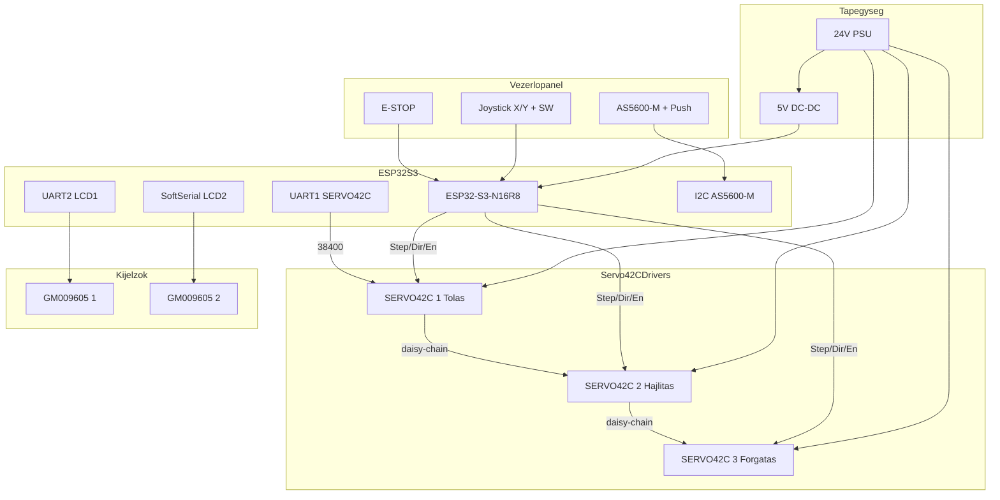

# Tube Bender ESP32-S3 GRBL Firmware

3-tengelyes csőhajlító gép vezérlő firmware ESP32-S3-N16R8 boardra.

## Funkciók

- 3 tengely Step/Dir/Enable vezérlés (Tolás, Hajlítás, Forgatás)
- SERVO42C closed-loop driver támogatás (Step/Dir + UART busz)
- Manuális joystick vezérlés (tolás + preview)
- AS5600-M encoderes vezérlőpanel (I2C + nyomógomb)
- Kijelzős menü navigáció (encoder forgatás + gomb)
- Program lépések rögzítése és lejátszása
- SPIFFS alapú program tárolás
- 2x GM009605 kijelző támogatás
- Native USB Serial GRBL protokoll (ESP32-S3 CDC)

## Hardver Követelmények

- ESP32-S3-N16R8 DevKitC-1
- 3x SERVO42C closed-loop stepper driver (beépített NEMA 17 motorral)
- Analóg joystick (2 tengely + gomb)
- AS5600-M mágneses encoder modul
- 1x encoder nyomógomb (menü select)
- 1x E-STOP nyomógomb
- GM009605V4 kijelző (opcionális, 2 db)
- 24V tápegység (5A)
- DC-DC step-down konverter (24V → 5V)

## Bekötési Rajz

### Színkódok

| Szín | Jelentés |
|------|----------|
| 🔴 Piros | 24V tápfeszültség |
| 🟠 Narancs | 5V tápfeszültség |
| 🟡 Sárga | 3.3V tápfeszültség |
| ⚫ Fekete | GND (föld) |
| 🔵 Kék | STEP jelek |
| 🟢 Zöld | DIR jelek |
| 🟣 Lila | ENABLE jel |
| 🩵 Cián | UART kommunikáció (SERVO42C) |
| ⚪ Fehér | Analóg bemenetek |
| 🟤 Barna | Digitális bemenetek |

### ESP32-S3 DevKit Pinout

```
                ESP32-S3 DevKitC-1 (N16R8)
    ┌──────────────────────────────────────────────────────────────┐
    │ J1 (bal oldal) - Motor/Driver                               │
    │  GPIO4   STEP1 (Tolás)          GPIO9   LCD2 TX             │
    │  GPIO5   DIR1  (Tolás)          GPIO10  LCD2 RX             │
    │  GPIO6   STEP2 (Hajlítás)       GPIO15  STEP3 (Forgatás)    │
    │  GPIO7   DIR2  (Hajlítás)       GPIO16  DIR3  (Forgatás)    │
    │  GPIO17  EN (közös)             GPIO18  SERVO UART TX       │
    │  GPIO8   SERVO UART RX                                       │
    │                                                              │
    │ J3 (jobb oldal) - Vezérlőpanel                              │
    │  GPIO1   Joystick X (ADC)       GPIO39  Encoder gomb        │
    │  GPIO2   Joystick Y (ADC)       GPIO38  E-STOP              │
    │  GPIO42  Joystick gomb          GPIO47  LCD1 TX (UART2)     │
    │  GPIO41  I2C SDA (AS5600-M)     GPIO21  LCD1 RX (UART2)     │
    │  GPIO40  I2C SCL (AS5600-M)                                  │
    └──────────────────────────────────────────────────────────────┘

    SERVO42C UART busz (daisy-chain):
    ESP32 GPIO18 (TX) -> Driver1 -> Driver2 -> Driver3
    ESP32 GPIO8  (RX) <- Driver1 <- Driver2 <- Driver3
```

### Rendszer Áttekintés



### SERVO42C Closed-Loop Driver Bekötés (Step/Dir + UART)

```
    SERVO42C Driver (integrált NEMA17)
    ┌─────────────────────────────────────────────────────┐
    │                                                     │
    │   6-pin csatlakozó (vezérlés + táp):               │
    │   ┌─────────────────────────────────────────┐       │
    │   │  Pin  │  Funkció     │  Bekötés         │       │
    │   ├───────┼──────────────┼──────────────────┤       │
    │   │   1   │  VCC (Táp)   │  🔴 12-24V       │       │
    │   │   2   │  GND         │  ⚫ GND          │       │
    │   │   3   │  COM         │  ⚫ Jelközös (GND referencia) │
    │   │   4   │  EN          │  GPIO17 (közös)  │       │
    │   │   5   │  STP         │  🔵 GPIO (lásd táblázat) │
    │   │   6   │  DIR         │  🟢 GPIO (lásd táblázat) │
    │   └─────────────────────────────────────────┘       │
    │                                                     │
    │   Fontos: COM != UART                               │
    │   A COMM/COM pin a Step/Dir/En közös referencia,    │
    │   UART kommunikáció külön 4-pin csatlakozón megy.   │
    │                                                     │
    │   UART 4-pin csatlakozó (kommunikáció):             │
    │   ┌─────────────────────────────────────────┐       │
    │   │  Pin  │  Funkció     │  Bekötés         │       │
    │   ├───────┼──────────────┼──────────────────┤       │
    │   │   1   │  TXD         │  ESP32 GPIO8 (RX)│       │
    │   │   2   │  RXD         │  ESP32 GPIO18(TX)│       │
    │   │   3   │  GND         │  ⚫ Közös GND     │       │
    │   │   4   │  3V3         │  (opcionális, modellfüggő)│
    │   └─────────────────────────────────────────┘       │
    │                                                     │
    │   Beépített funkciók:                               │
    │   • Closed-loop vezérlés (mágneses encoder)        │
    │   • Pozíció visszacsatolás UART-on                  │
    │   • Stall detekció                                  │
    │   • Mikrolépés beállítás (firmware)                │
    │                                                     │
    └─────────────────────────────────────────────────────┘

    UART Daisy-Chain bekötés (4-pin UART headeren):
    ┌─────────────────────────────────────────────────────────────────────┐
    │                                                                     │
    │   ESP32-S3             SERVO42C #1        SERVO42C #2        SERVO42C #3
    │                        (Tolás)            (Hajlítás)         (Forgatás)
    │                        Addr: 0x01         Addr: 0x02         Addr: 0x03
    │                                                                     │
    │   GPIO18 (TX) ───────→ UART ────────────→ UART ────────────→ UART   │
    │   GPIO8  (RX) ←─────── UART ←──────────── UART ←──────────── UART   │
    │                                                                     │
    │   UART konfiguráció:                                                │
    │   • Baud rate: 38400                                                │
    │   • Protokoll: MKS SERVO42C                                         │
    │   • Címzés: Egyedi cím driverenként                                 │
    │                                                                     │
    └─────────────────────────────────────────────────────────────────────┘

    SERVO42C dip-switch beállítások (cím):
    ┌─────────────────────────────────────┐
    │  Driver   │  SW1  │  SW2  │  Cím   │
    ├───────────┼───────┼───────┼────────┤
    │  Tolás    │  ON   │  OFF  │  0x01  │
    │  Hajlítás │  OFF  │  ON   │  0x02  │
    │  Forgatás │  ON   │  ON   │  0x03  │
    └─────────────────────────────────────┘
```

### SERVO42C Bekötési Táblázat (motor oldal - J1)

| Driver | Funkció | STP Pin | DIR Pin | EN Pin | COM Pin | UART | Addr |
|--------|---------|---------|---------|--------|---------|------|------|
| SERVO42C #1 | Tolás | GPIO4 | GPIO5 | GPIO17 | GND közös | 4-pin UART busz | 0x01 |
| SERVO42C #2 | Hajlítás | GPIO6 | GPIO7 | GPIO17 | GND közös | 4-pin UART busz | 0x02 |
| SERVO42C #3 | Forgatás | GPIO15 | GPIO16 | GPIO17 | GND közös | 4-pin UART busz | 0x03 |

**UART busz (4-pin header):** GPIO8 (RX) / GPIO18 (TX) - 38400 baud, daisy-chain
**Megjegyzés:** a 6-pin COM láb nem UART adatvonal.

### Vezérlőpanel Bekötése (jobb oldal - J3)

```
    Joystick Modul              AS5600-M Encoder (I2C)
    ┌─────────────┐             ┌────────────────────┐
    │ GND ●───GND │             │ VCC ●───3.3V       │
    │ VCC ●───3.3V│             │ GND ●───GND        │
    │ VRx ●───GPIO1             │ SDA ●───GPIO41     │
    │ VRy ●───GPIO2             │ SCL ●───GPIO40     │
    │  SW ●───GPIO42            └────────────────────┘
    └─────────────┘

    Encoder gomb + E-STOP (ACTIVE LOW)
    ┌─────────────────────────────────────────┐
    │  Bemenet          │  Pin      │  Bekötés │
    ├───────────────────┼───────────┼──────────┤
    │  Encoder select   │  GPIO39   │ GND ↔ GPIO
    │  E-STOP           │  GPIO38   │ NC ↔ GPIO
    └─────────────────────────────────────────┘
```

### Kijelzők Bekötése (GM009605V4)

```
    GM009605 Kijelző #1 (UART2)          GM009605 Kijelző #2 (SoftSerial)
    ┌─────────────────┐                   ┌─────────────────┐
    │ VCC ●───🟠 5V   │                   │ VCC ●───🟠 5V   │
    │ GND ●───⚫ GND  │                   │ GND ●───⚫ GND  │
    │  TX ●───GPIO47  │                   │  TX ●───GPIO9   │
    │  RX ●───GPIO21  │                   │  RX ●───GPIO10  │
    └─────────────────┘                   └─────────────────┘
    (9600 baud, Nextion protokoll)
```

## GPIO Kiosztás

```
SERVO42C DRIVEREK (Step/Dir)
  GPIO4  - SERVO42C #1 STEP (Tolás)
  GPIO5  - SERVO42C #1 DIR
  GPIO6  - SERVO42C #2 STEP (Hajlítás)
  GPIO7  - SERVO42C #2 DIR
  GPIO15 - SERVO42C #3 STEP (Forgatás)
  GPIO16 - SERVO42C #3 DIR
  GPIO17 - ENABLE (közös, active LOW)

SERVO42C UART BUSZ
  GPIO8  - UART1 RX (SERVO 4-pin TXD -> ESP RX)
  GPIO18 - UART1 TX (SERVO 4-pin RXD <- ESP TX)
  UART a külön 4-pin csatlakozón megy, nem a 6-pin COM lábon
  Baud: 38400

ANALÓG BEMENETEK
  GPIO1  - Joystick X
  GPIO2  - Joystick Y

DIGITÁLIS BEMENETEK
  GPIO42 - Joystick gomb
  GPIO39 - Encoder gomb
  GPIO38 - E-STOP

I2C (AS5600-M)
  GPIO41 - SDA
  GPIO40 - SCL

KIJELZŐK
  GPIO47/GPIO21 - Kijelző 1 (UART2 TX/RX)
  GPIO9/GPIO10  - Kijelző 2 (SoftwareSerial TX/RX)
```

## Menu Vezérlés (AS5600-M)

- Encoder forgatás: menüpont választás
- Encoder gomb: aktuális menüpont aktiválása
- Fő menü (IDLE): `Run Program`, `Teach Mode`, `Clear Program`, `Home Zero`
- Futás közben: `Pause`, `Stop`
- Szünetben: `Resume`, `Stop`
- Teaching módban: `Exit Teach`, `Clear Program`, `Home Zero`

## Telepítés

### GRBL stack (ajánlott)

A jelenlegi rendszer GRBL-alapú csőhajlító adapterrel működik.
Javasolt firmware alap:
- `grbl_esp32` ESP32-S3 célon
- tengely mapping: `X=Tolás`, `Y=Hajlítás`, `Z=Forgatás`
- unit mapping: `X=mm`, `Y/Z=deg` (GRBL tengelyegységként kezelve)

A host oldali adapter (`drivers/tube_bender_driver.py`) tube-bender lépéseket futáskor G-code sorokká fordít.

### PlatformIO (meglévő projekt)

Az alapértelmezett környezet az egyedi N16R8 board profil:
- `board = esp32-s3-devkitc-1-n16r8`
- board fájl: `boards/esp32-s3-devkitc-1-n16r8.json`

```bash
cd firmware/tube_bender
pio run -e esp32s3
pio run -t upload
pio run -t uploadfs  # SPIFFS feltöltése
```

### Arduino IDE

1. Telepítsd az ESP32 board támogatást
2. Telepítsd a függőségeket:
   - AccelStepper
   - ArduinoJson
   - EspSoftwareSerial
   - AS5600 (Rob Tillaart)
3. Nyisd meg a `src/main.cpp` fájlt
4. Válaszd az ESP32-S3 Dev Module boardot
5. Töltsd fel

## Használat

### Manuális Mód

1. Kapcsold be a gépet
2. Tartsd nyomva a joystick gombot a kézi jog aktiválásához
3. A joystick X tengellyel told a csövet (gomb nyomva tartása közben)
4. Az AS5600 encoderrel állítsd be a hajlítási célszöget
5. Rövid joystick gombnyomással indítható a hajlítási lépés

Megjegyzés:
- Joystick gomb nélkül a firmware nem lép `MANUAL_JOG` állapotba.
- Lebegő/zajos joystick bemenetnél a firmware fail-safe módban tiltja a kézi jogot.

### Teaching Mód

1. Az encoder menüben válaszd a `Teach Mode` pontot
2. Pozicionáld a csövet joystickkal
3. Állítsd be a szöget az encoderrel
4. Nyomd meg a joystick gombot a lépés rögzítéséhez
5. Ismételd a 2-4 lépéseket
6. Menüben válaszd az `Exit Teach` pontot

### Program Futtatás

1. Menüben válaszd a `Run Program` pontot
2. A gép automatikusan végrehajtja a rögzített lépéseket
3. Futás közben menüből `Pause` vagy `Stop` választható
4. Szünetből menüből `Resume` vagy `Stop` választható

## Serial Parancsok (GRBL)

```text
; Státusz
?

; Homing
$H

; Alarm unlock
$X

; Jog (példák)
$J=G91 X10 F600      ; tolás +10 mm
$J=G91 Y15 F300      ; hajlítás +15 fok
$J=G91 Z-20 F300     ; forgatás -20 fok

; Jog stop
!                    ; feed hold / jog cancel
~

; Programfuttatás (host streameli a G-code-ot)
G21
G90
G1 X120.000 F1000
G1 Y45.000 F600
G1 Y0.000 F600
G91
G1 Z30.000 F600
G90
M400
```

### Tengely és funkció mapping

| Csőhajlító funkció | GRBL tengely |
|--------------------|--------------|
| Tolás (push)       | X            |
| Hajlítás (bend)    | Y            |
| Forgatás (rot)     | Z            |

## Hibaelhárítás

### A motor nem mozog
- Ellenőrizd az ENABLE pin állapotát (LOW = aktív)
- Ellenőrizd a tápfeszültséget (12-24V)
- Ellenőrizd a SERVO42C LED állapotát
- UART-on kérdezd le a driver státuszát

### SERVO42C nem kommunikál
- Ellenőrizd az UART bekötést a 4-pin csatlakozón (TXD/RXD/GND)
- Ellenőrizd az ESP32 UART pineket (GPIO8 RX, GPIO18 TX)
- Ellenőrizd a baud rate-et (38400)
- Ellenőrizd a driver címét (dip-switch)
- Ellenőrizd a daisy-chain sorrendet

### GRBL jog nem indul
- Ellenőrizd, hogy nem `Alarm` vagy `Door` állapotban van-e a vezérlő (`?`)
- Küldj `$X` parancsot unlock-hoz
- Ellenőrizd a soft/hard limiteket (`$20`, `$21`) és tengely utakat (`$130-132`)

### Joystick nem reagál
- Ellenőrizd az ADC értékeket Serial monitoron
- Állítsd be a deadzone értéket a config.h-ban
- Ellenőrizd, hogy a joystick gomb (GPIO42) be van-e kötve (active LOW)
- Joystick nélküli rendszernél hagyd a GPIO42-t PULLUP állapotban (nyitott gomb = nincs jog)

### AS5600 encoder nem reagál
- Ellenőrizd az I2C bekötést (GPIO41/40)
- Ellenőrizd a tápot (3.3V)
- Ellenőrizd a mágnes pozícióját az AS5600 felett
- Ellenőrizd az I2C címet (0x36)

### Kijelző nem működik
- Ellenőrizd a baud rate-et (9600)
- Ellenőrizd a TX/RX bekötést (GPIO47/21 vagy GPIO9/10)

## Licenc

MIT License
